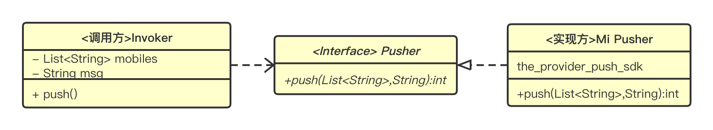

https://blog.95id.com/magic_in_java_spi.html

### 工程目录


```shell
$ tree -L 1
.
├── invoker #测试工程，服务接口的调用程序
├── pom.xml
├── push_interface #推送服务接口
├── push_jiguang_provider #实现方式：极光推送
├── push_mi_provider #实现方式：小米推送
```


- push_interface工程: 定义推送的接口，约定需要传入的参数(手机号码，推送的消息)，输出的为推送成功的条数
- push_jiguang_provider/push_mi_provider工程： 根据极光的sdk或者小米的sdk，实现了push_interface的push接口
- invoker工程: 用来测试的工程，主要是通过spi机制调用

三个工程之间的关系如图：



### 测试

想用哪个provider，就将该provider的jar包放到扩展目录中，spi 会自动加载该实现类

```bash
#在工程目录中执行
#编译
mvn clean package

# 方式一： copy 到jre/lib/ext/目录
sudo cp push_jiguang_provider/target/push_jiguang_provider-1.0-jar-with-dependencies.jar ${JAVA_HOME}/jre/lib/ext/

java -jar invoker/target/invoker-1.0-jar-with-dependencies.jar

# 方式二：改变默认的扩展目录，ext.dirs 
java -Djava.ext.dirs=./push_jiguang_provider/target/ -jar invoker/target/invoker-1.0-jar-with-dependencies.jar

java -Djava.ext.dirs=./push_mi_provider/target/ -jar invoker/target/invoker-1.0-jar-with-dependencies.jar

# 方式三：Xbootclasspath 
java -Xbootclasspath/a:./push_jiguang_provider/target/push_jiguang_provider-1.0-jar-with-dependencies.jar -jar invoker/target/invoker-1.0-jar-with-dependencies.jar
```